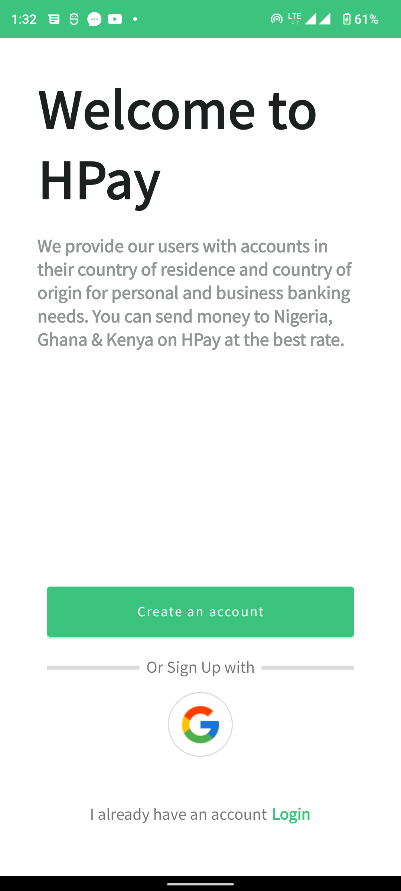
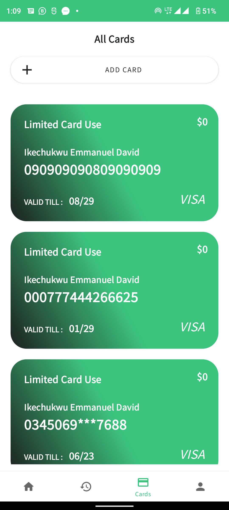

# HPAY

[](https://kotlinlang.org/) [](http://hannesdorfmann.com/android/mosby3-mvi-1) [](https://developer.android.com/kotlin/coroutines) [](https://dagger.dev/hilt)

An online Banking mobile template designed with firebase firestore and MVVM architecture that can send, receive and transfer demo money and store those information in a secured firebase database 

## Authentication
Try it out using this email and password

```bash
kuradavis987@gmail.com
COnYFW1$1cZEGaC
```

## Tech
* Bar Chat
* Firebase Firestore
* Live Data
* DataBiding
* ViewModel
* MVVM
* Navigation Components
* Android X
* Life Cycle

## Prerequisite
To build this project, you require:
- Android Studio artic fox canary 6
- Gradle 7.0

## Libraries
*   [ViewModel](https://developer.android.com/topic/libraries/architecture/viewmodel)
*   [Dagger Hilt](https://dagger.dev/hilt)
*   [Kotlin Gradle DSL](https://guides.gradle.org/migrating-build-logic-from-groovy-to-kotlin)
*   [Firebase](https://firebase.google.com/)

<h2 align="left">Screenshots</h2>
<h4 align="start">






<br>

## Author
Iyke Emmanuel

## License
This project is licensed under the Apache License 2.0 - See: http://www.apache.org/licenses/LICENSE-2.0.txt